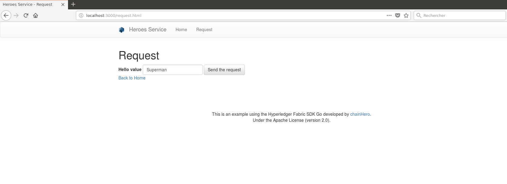
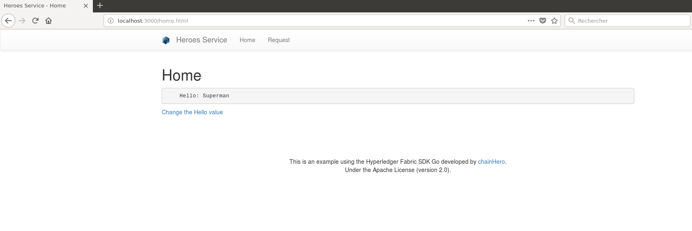

# Tutorial Hyperledger Fabric SDK Go: How to build your first app?

Source: [chainhero.io/2018/03/tutorial-build-blockchain-app-2](https://chainhero.io/2018/03/tutorial-build-blockchain-app-2/)

This tutorial will introduce you to the Hyperledger Fabric Go SDK and allows you to build a simple application using the blockchain principle.

**This tutorial uses Hyperledger Fabric version 1.1.0**

This is the **first part** of this tutorial. The basics SDK features will be shown, but the second part is scheduled to demonstrate a more complex application.

## 1. Prerequisites

This tutorial won’t explain in detail how Hyperledger Fabric works. I will just give some tips to understand the general behavior of the framework. If you want to get a full explanation of the tool, go to the official [documentation](http://hyperledger-fabric.readthedocs.io/en/latest/) there is a lot of work there that explains what kind of blockchain Hyperledger Fabric is.

This tutorial has been made on **Ubuntu 16.04** but the Hyperledger Fabric framework is compatible with Mac OS X, Windows and other Linux distributions.

We will use the **Go** language to design our first application because the Hyperledger Fabric has been also built in Go and the Fabric SDK Go is really simple to use. In addition, the chaincode (smart contract) can be written in Go too. So the full-stack will be only in Go! Awesome right ? However, if you are go phobic, there are other SDK like for NodeJS, Java or Python but we won't discuss about them here.

Hyperledger Fabric uses **Docker** to easily deploy a blockchain network. In addition, some components (peers) also deploys docker containers to separate data (channel). So make sure that your platform supports this kind of virtualization.

## 2. Introduction to Hyperledger Fabric

> Hyperledger Fabric is a platform for distributed ledger solutions underpinned by a modular architecture delivering high degrees of confidentiality, resiliency, flexibility and scalability. It is designed to support pluggable implementations of different components and accommodate the complexity and intricacies that exist across the economic ecosystem.

See the full explanation from the official documentation in the introduction part: [Hyperledger Fabric Blockchain](http://hyperledger-fabric.readthedocs.io/en/latest/blockchain.html)


## 3. Installation guide

This tutorial was made on **Ubuntu 16.04**, but there is help for Windows, Mac OS X and other Linux distributions users.

### a. Docker

**Docker version 17.03.0-ce or greater is required.**

#### Linux (Ubuntu)

First of all, in order to install docker correctly we need to install its dependencies:

```bash
sudo apt install apt-transport-https ca-certificates curl software-properties-common
```

Once the dependencies are installed, we can install docker:

```bash
curl -fsSL https://download.docker.com/linux/ubuntu/gpg | sudo apt-key add - && \
sudo add-apt-repository "deb [arch=amd64] https://download.docker.com/linux/ubuntu $(lsb_release -cs) stable" && \
sudo apt update && \
sudo apt install -y docker-ce
```

Now we need to manage the current user to avoid using administration rights (`root`) access when we will use the docker command. To do so, we need to add the current user to the `docker` group:

```bash
sudo groupadd docker ; \
sudo gpasswd -a ${USER} docker && \
sudo service docker restart
```

Do not mind if `groupadd: group 'docker' already exists` error pop up.

To apply the changes made, you need to logout/login. You can then check your version with:

```bash
docker -v
```


#### Mac OS X

Download and install the latest [`Docker.dmg`](https://docs.docker.com/docker-for-mac/install/) package for Mac OS X available on the [Docker](https://docs.docker.com/docker-for-mac/install/) website. This will install `docker-compose` as well, so you can skip the next step.

#### Linux (not Ubuntu)

See links below:
- [Debian](https://docs.docker.com/engine/installation/linux/docker-ce/debian/)
- [Fedora](https://docs.docker.com/engine/installation/linux/docker-ce/fedora/)
- [CentOS](https://docs.docker.com/engine/installation/linux/docker-ce/centos/)

#### Windows

See instructions from the Docker website: [docker.com/docker-for-windows](https://docs.docker.com/docker-for-windows/install/)

### b. Docker Compose

**Docker-compose version 1.8 or greater is required.**

We are currently unable to manage easily multiple containers at once. To solve this issue, we need **docker-compose**.

#### Linux

The installation is pretty fast:

```bash
sudo curl -L https://github.com/docker/compose/releases/download/1.21.2/docker-compose-$(uname -s)-$(uname -m) -o /usr/local/bin/docker-compose
```

Apply these changes by logout/login and then check its version with:

```bash
docker-compose version
```


#### Windows / Others

See instructions from the Docker-compose website: [docs.docker.com/compose/install](https://docs.docker.com/compose/install/)

### c. Go

**Go version 1.9.x or greater is required.**

#### Linux

You can either follow instructions from [golang.org](https://golang.org/dl/) or use those generics commands that will install Golang 1.9.2 and prepare your environment (generate your `GOPATH`) for Ubuntu:

```bash
wget https://storage.googleapis.com/golang/go1.9.2.linux-amd64.tar.gz && \
sudo tar -C /usr/local -xzf go1.9.2.linux-amd64.tar.gz && \
rm go1.9.2.linux-amd64.tar.gz && \
echo 'export PATH=$PATH:/usr/local/go/bin' | sudo tee -a /etc/profile && \
echo 'export GOPATH=$HOME/go' | tee -a $HOME/.bashrc && \
echo 'export PATH=$PATH:$GOROOT/bin:$GOPATH/bin' | tee -a $HOME/.bashrc && \
mkdir -p $HOME/go/{src,pkg,bin}
```

To make sure that the installation works, you can logout/login (again) and run:

```bash
go version
```


#### Windows / Mac OS X / Others

See instructions from the Golang website: [golang.org/install](https://golang.org/doc/install)

## 4. Make your first blockchain network

### a. Prepare environment

In order to make a blockchain network, we will use `docker` to build virtual computers that will handle different roles. In this tutorial we will stay as simple as possible. Hyperledger Fabric needs a lot of certificates to ensure encryption during the whole end to end process (TSL, authentications, signing blocks...). The creation of these files requires a little time and in order to go straight to the heart of the matter, we have already prepared all this for you in the folder `fixtures` in this repository.

Make a new directory in the `src` folder of your `GOPATH`, following our repository naming:

```bash
mkdir -p $GOPATH/src/github.com/chainHero/heroes-service && \
cd $GOPATH/src/github.com/chainHero/heroes-service
```

To get the `fixtures` folder, you can either follow this command line, which will install and use subversion to get the folder from this repository. Or download the [zip file from Github](https://github.com/chainHero/heroes-service/archive/v1.1.0.zip) and extract only the `fixtures` folder.

```bash
sudo apt install -y subversion && \
cd $GOPATH/src/github.com/chainHero/heroes-service && \
svn checkout https://github.com/chainHero/heroes-service/branches/v1.1.0/fixtures &&
rm -rf fixtures/.svn
```

Alternatively, if you want to know how to build this fixture folder and learn how to create the blockchain network, follow this quick tutorial on [how to build your first network](https://chainhero.io/2018/04/tutorial-hyperledger-fabric-how-to-build-your-first-network/).

### b. Test

In order to check if the network works, we will use `docker-compose` to start or stop all containers at the same time. Go inside the `fixtures` folder, and run:

```bash
cd $GOPATH/src/github.com/chainHero/heroes-service/fixtures && \
docker-compose up
```

You will see a lot of logs with different colors (for your information, red isn't equal to errors).

Open a new terminal and run:

```bash
docker ps
```


You will see : two peers, the orderer and one CA containers. You have successfully made a new network ready to use with the SDK. To stop the network go back to the previous terminal, press `Ctrl+C` and wait that all containers are stopped. If you want to explore more deeper, follow our tutorial dedicated to the network part [here](https://chainhero.io/2018/04/tutorial-hyperledger-fabric-how-to-build-your-first-network/) or  check out the official documentation about this: [Building Your First Network](http://hyperledger-fabric.readthedocs.io/en/latest/build_network.html)

> **Tips**: when the network is stopped, all containers used remain accessible. This is very useful to check logs for example. You can see stopped containers with `docker ps -a`. In order to clean up these containers, you need to delete them with `docker rm $(docker ps -aq)` or if you have used a `docker-compose` file, go where this file is and run `docker-compose down`.

> **Tips**: you can run the `docker-compose` command in background to keep the prompt. To do so, use the parameter `-d`, like this: `docker-compose up -d`. To stop containers, place yourself in the same folder where the `docker-compose.yaml` is and run : `docker-compose stop` (or `docker-compose down` to additionally clean up all containers when they are stopped).


## 5. Use the Fabric SDK Go

### a. Configuration

Our application needs a lot of parameters, especially the addresses of the Fabric's components to communicate. We will put everything in a new configuration file, the Fabric SDK Go configuration and our custom parameters. For the moment, we will only try to make the Fabric SDK Go works with the default chaincode:

```bash
cd $GOPATH/src/github.com/chainHero/heroes-service && \
vi config.yaml
```

```yaml
name: "heroes-service-network"
#
# Schema version of the content. Used by the SDK to apply the corresponding parsing rules.
#
version: 1.0.0

#
# The client section used by GO SDK.
#
client:

  # Which organization does this application instance belong to? The value must be the name of an org
  # defined under "organizations"
  organization: org1

  logging:
    level: info

  # Global configuration for peer, event service and orderer timeouts
  # if this this section is omitted, then default values will be used (same values as below)
#  peer:
#    timeout:
#      connection: 10s
#      response: 180s
#      discovery:
#        # Expiry period for discovery service greylist filter
#        # The channel client will greylist peers that are found to be offline
#        # to prevent re-selecting them in subsequent retries.
#        # This interval will define how long a peer is greylisted
#        greylistExpiry: 10s
#  eventService:
#    # Event service type (optional). If not specified then the type is automatically
#    # determined from channel capabilities.
#    type: (deliver|eventhub)
    # the below timeouts are commented out to use the default values that are found in
    # "pkg/fab/endpointconfig.go"
    # the client is free to override the default values by uncommenting and resetting
    # the values as they see fit in their config file
#    timeout:
#      connection: 15s
#      registrationResponse: 15s
#  orderer:
#    timeout:
#      connection: 15s
#      response: 15s
#  global:
#    timeout:
#      query: 180s
#      execute: 180s
#      resmgmt: 180s
#    cache:
#      connectionIdle: 30s
#      eventServiceIdle: 2m
#      channelConfig: 30m
#      channelMembership: 30s
#      discovery: 10s
#      selection: 10m

  # Root of the MSP directories with keys and certs.
  cryptoconfig:
    path: ${GOPATH}/src/github.com/chainHero/heroes-service/fixtures/crypto-config

  # Some SDKs support pluggable KV stores, the properties under "credentialStore"
  # are implementation specific
  credentialStore:
    path: /tmp/state-store

    # [Optional]. Specific to the CryptoSuite implementation used by GO SDK. Software-based implementations
    # requiring a key store. PKCS#11 based implementations does not.
    cryptoStore:
      path: /tmp/msp

   # BCCSP config for the client. Used by GO SDK.
  BCCSP:
    security:
     enabled: true
     default:
      provider: "SW"
     hashAlgorithm: "SHA2"
     softVerify: true
     level: 256

  tlsCerts:
    # [Optional]. Use system certificate pool when connecting to peers, orderers (for negotiating TLS) Default: false
    systemCertPool: false

    # [Optional]. Client key and cert for TLS handshake with peers and orderers
    client:
      keyfile:
      certfile:

#
# [Optional]. But most apps would have this section so that channel objects can be constructed
# based on the content below. If an app is creating channels, then it likely will not need this
# section.
#
channels:
  # name of the channel
  chainhero:
    # Required. list of orderers designated by the application to use for transactions on this
    # channel. This list can be a result of access control ("org1" can only access "ordererA"), or
    # operational decisions to share loads from applications among the orderers.  The values must
    # be "names" of orgs defined under "organizations/peers"
    # deprecated: not recommended, to override any orderer configuration items, entity matchers should be used.
    # orderers:
    #  - orderer.example.com

    # Required. list of peers from participating orgs
    peers:
      peer0.org1.hf.chainhero.io:
        # [Optional]. will this peer be sent transaction proposals for endorsement? The peer must
        # have the chaincode installed. The app can also use this property to decide which peers
        # to send the chaincode install request. Default: true
        endorsingPeer: true

        # [Optional]. will this peer be sent query proposals? The peer must have the chaincode
        # installed. The app can also use this property to decide which peers to send the
        # chaincode install request. Default: true
        chaincodeQuery: true

        # [Optional]. will this peer be sent query proposals that do not require chaincodes, like
        # queryBlock(), queryTransaction(), etc. Default: true
        ledgerQuery: true

        # [Optional]. will this peer be the target of the SDK's listener registration? All peers can
        # produce events but the app typically only needs to connect to one to listen to events.
        # Default: true
        eventSource: true

      peer1.org1.hf.chainhero.io:

    policies:
      #[Optional] options for retrieving channel configuration blocks
      queryChannelConfig:
        #[Optional] min number of success responses (from targets/peers)
        minResponses: 1
        #[Optional] channel config will be retrieved for these number of random targets
        maxTargets: 1
        #[Optional] retry options for query config block
        retryOpts:
          #[Optional] number of retry attempts
          attempts: 5
          #[Optional] the back off interval for the first retry attempt
          initialBackoff: 500ms
          #[Optional] the maximum back off interval for any retry attempt
          maxBackoff: 5s
          #[Optional] he factor by which the initial back off period is exponentially incremented
          backoffFactor: 2.0


#
# list of participating organizations in this network
#
organizations:
  org1:
    mspid: org1.hf.chainhero.io
    cryptoPath: peerOrganizations/org1.hf.chainhero.io/users/{userName}@org1.hf.chainhero.io/msp
    peers:
      - peer0.org1.hf.chainhero.io
      - peer1.org1.hf.chainhero.io

    # [Optional]. Certificate Authorities issue certificates for identification purposes in a Fabric based
    # network. Typically certificates provisioning is done in a separate process outside of the
    # runtime network. Fabric-CA is a special certificate authority that provides a REST APIs for
    # dynamic certificate management (enroll, revoke, re-enroll). The following section is only for
    # Fabric-CA servers.
    certificateAuthorities:
      - ca.org1.hf.chainhero.io

#
# List of orderers to send transaction and channel create/update requests to. For the time
# being only one orderer is needed. If more than one is defined, which one get used by the
# SDK is implementation specific. Consult each SDK's documentation for its handling of orderers.
#
orderers:
  orderer.hf.chainhero.io:
    url: localhost:7050

    # these are standard properties defined by the gRPC library
    # they will be passed in as-is to gRPC client constructor
    grpcOptions:
      ssl-target-name-override: orderer.hf.chainhero.io
      # These parameters should be set in coordination with the keepalive policy on the server,
      # as incompatible settings can result in closing of connection.
      # When duration of the 'keep-alive-time' is set to 0 or less the keep alive client parameters are disabled
      keep-alive-time: 0s
      keep-alive-timeout: 20s
      keep-alive-permit: false
      fail-fast: false
      # allow-insecure will be taken into consideration if address has no protocol defined, if true then grpc or else grpcs
      allow-insecure: false

    tlsCACerts:
      # Certificate location absolute path
      path: ${GOPATH}/src/github.com/chainHero/heroes-service/fixtures/crypto-config/ordererOrganizations/hf.chainhero.io/tlsca/tlsca.hf.chainhero.io-cert.pem
#
# List of peers to send various requests to, including endorsement, query
# and event listener registration.
#
peers:
  peer0.org1.hf.chainhero.io:
    # this URL is used to send endorsement and query requests
    url: localhost:7051
    # eventUrl is only needed when using eventhub (default is delivery service)
    eventUrl: localhost:7053

    grpcOptions:
      ssl-target-name-override: peer0.org1.hf.chainhero.io
      # These parameters should be set in coordination with the keepalive policy on the server,
      # as incompatible settings can result in closing of connection.
      # When duration of the 'keep-alive-time' is set to 0 or less the keep alive client parameters are disabled
      keep-alive-time: 0s
      keep-alive-timeout: 20s
      keep-alive-permit: false
      fail-fast: false
      # allow-insecure will be taken into consideration if address has no protocol defined, if true then grpc or else grpcs
      allow-insecure: false

    tlsCACerts:
      # Certificate location absolute path
      path: ${GOPATH}/src/github.com/chainHero/heroes-service/fixtures/crypto-config/peerOrganizations/org1.hf.chainhero.io/tlsca/tlsca.org1.hf.chainhero.io-cert.pem

  peer1.org1.hf.chainhero.io:
    # this URL is used to send endorsement and query requests
    url: localhost:8051
    # eventUrl is only needed when using eventhub (default is delivery service)
    eventUrl: localhost:8053

    grpcOptions:
      ssl-target-name-override: peer1.org1.hf.chainhero.io
      # These parameters should be set in coordination with the keepalive policy on the server,
      # as incompatible settings can result in closing of connection.
      # When duration of the 'keep-alive-time' is set to 0 or less the keep alive client parameters are disabled
      keep-alive-time: 0s
      keep-alive-timeout: 20s
      keep-alive-permit: false
      fail-fast: false
      # allow-insecure will be taken into consideration if address has no protocol defined, if true then grpc or else grpcs
      allow-insecure: false

    tlsCACerts:
      # Certificate location absolute path
      path: ${GOPATH}/src/github.com/chainHero/heroes-service/fixtures/crypto-config/peerOrganizations/org1.hf.chainhero.io/tlsca/tlsca.org1.hf.chainhero.io-cert.pem

#
# Fabric-CA is a special kind of Certificate Authority provided by Hyperledger Fabric which allows
# certificate management to be done via REST APIs. Application may choose to use a standard
# Certificate Authority instead of Fabric-CA, in which case this section would not be specified.
#
certificateAuthorities:
  ca.org1.hf.chainhero.io:
    url: http://localhost:7054
    # Fabric-CA supports dynamic user enrollment via REST APIs. A "root" user, a.k.a registrar, is
    # needed to enroll and invoke new users.
    httpOptions:
      verify: false
    registrar:
      enrollId: admin
      enrollSecret: adminpw
    # [Optional] The optional name of the CA.
    caName: ca.org1.hf.chainhero.io
    tlsCACerts:
      # Certificate location absolute path
      path: ${GOPATH}/src/github.com/chainHero/heroes-service/fixtures/crypto-config/peerOrganizations/org1.hf.chainhero.io/ca/ca.org1.hf.chainhero.io-cert.pem

entityMatchers:
  peer:
    - pattern: (\w*)peer0.org1.hf.chainhero.io(\w*)
      urlSubstitutionExp: localhost:7051
      eventUrlSubstitutionExp: localhost:7053
      sslTargetOverrideUrlSubstitutionExp: peer0.org1.hf.chainhero.io
      mappedHost: peer0.org1.hf.chainhero.io

    - pattern: (\w*)peer1.org1.hf.chainhero.io(\w*)
      urlSubstitutionExp: localhost:8051
      eventUrlSubstitutionExp: localhost:8053
      sslTargetOverrideUrlSubstitutionExp: peer1.org1.hf.chainhero.io
      mappedHost: peer1.org1.hf.chainhero.io

  orderer:
    - pattern: (\w*)orderer.hf.chainhero.io(\w*)
      urlSubstitutionExp: localhost:7050
      sslTargetOverrideUrlSubstitutionExp: orderer.hf.chainhero.io
      mappedHost: orderer.hf.chainhero.io

  certificateAuthorities:
    - pattern: (\w*)ca.org1.hf.chainhero.io(\w*)
      urlSubstitutionExp: http://localhost:7054
      mappedHost: ca.org1.hf.chainhero.io
```

The configuration file is also available here: [`config.yaml`](config.yaml)

### b. Initialise

We add a new folder named `blockchain` that will contain the whole interface that communicate with the network. We will see the Fabric SDK Go only in this folder.

```bash
mkdir $GOPATH/src/github.com/chainHero/heroes-service/blockchain
```

Now, we add a new go file named `setup.go` :

```bash
vi $GOPATH/src/github.com/chainHero/heroes-service/blockchain/setup.go
```

```go
package blockchain

import (
	"fmt"
	mspclient "github.com/hyperledger/fabric-sdk-go/pkg/client/msp"
	"github.com/hyperledger/fabric-sdk-go/pkg/client/resmgmt"
	"github.com/hyperledger/fabric-sdk-go/pkg/common/errors/retry"
	"github.com/hyperledger/fabric-sdk-go/pkg/common/providers/msp"
	"github.com/hyperledger/fabric-sdk-go/pkg/core/config"
	"github.com/hyperledger/fabric-sdk-go/pkg/fabsdk"
	"github.com/pkg/errors"
)

// FabricSetup implementation
type FabricSetup struct {
	ConfigFile      string
	OrgID           string
	OrdererID	string
	ChannelID       string
	ChainCodeID     string
	initialized     bool
	ChannelConfig   string
	ChaincodeGoPath string
	ChaincodePath   string
	OrgAdmin        string
	OrgName         string
	UserName        string
	admin           *resmgmt.Client
	sdk             *fabsdk.FabricSDK
}

// Initialize reads the configuration file and sets up the client, chain and event hub
func (setup *FabricSetup) Initialize() error {

	// Add parameters for the initialization
	if setup.initialized {
		return errors.New("sdk already initialized")
	}

	// Initialize the SDK with the configuration file
	sdk, err := fabsdk.New(config.FromFile(setup.ConfigFile))
	if err != nil {
		return errors.WithMessage(err, "failed to create SDK")
	}
	setup.sdk = sdk
	fmt.Println("SDK created")

	// The resource management client is responsible for managing channels (create/update channel)
	resourceManagerClientContext := setup.sdk.Context(fabsdk.WithUser(setup.OrgAdmin), fabsdk.WithOrg(setup.OrgName))
	if err != nil {
		return errors.WithMessage(err, "failed to load Admin identity")
	}
	resMgmtClient, err := resmgmt.New(resourceManagerClientContext)
	if err != nil {
		return errors.WithMessage(err, "failed to create channel management client from Admin identity")
	}
	setup.admin = resMgmtClient
	fmt.Println("Ressource management client created")

	// The MSP client allow us to retrieve user information from their identity, like its signing identity which we will need to save the channel
	mspClient, err := mspclient.New(sdk.Context(), mspclient.WithOrg(setup.OrgName))
	if err != nil {
		return errors.WithMessage(err, "failed to create MSP client")
	}
	adminIdentity, err := mspClient.GetSigningIdentity(setup.OrgAdmin)
	if err != nil {
		return errors.WithMessage(err, "failed to get admin signing identity")
	}
	req := resmgmt.SaveChannelRequest{ChannelID: setup.ChannelID, ChannelConfigPath: setup.ChannelConfig, SigningIdentities: []msp.SigningIdentity{adminIdentity}}
	txID, err := setup.admin.SaveChannel(req, resmgmt.WithOrdererEndpoint(setup.OrdererID))
	if err != nil || txID.TransactionID == "" {
		return errors.WithMessage(err, "failed to save channel")
	}
	fmt.Println("Channel created")

	// Make admin user join the previously created channel
	if err = setup.admin.JoinChannel(setup.ChannelID, resmgmt.WithRetry(retry.DefaultResMgmtOpts), resmgmt.WithOrdererEndpoint(setup.OrdererID)); err != nil {
		return errors.WithMessage(err, "failed to make admin join channel")
	}
	fmt.Println("Channel joined")

	fmt.Println("Initialization Successful")
	setup.initialized = true
	return nil
}

func (setup *FabricSetup) CloseSDK() {
	setup.sdk.Close()
}

```

The file is available here: [`blockchain/setup.go`](blockchain/setup.go)

At this stage, we only initialized a client that will communicate to a peer, a CA and an orderer. We also made a new channel and connected this peer to this channel. See the comments in the code for more information.

### c. Test

To make sure that the client managed to initialize all his components, we will make a simple test with the network launched. In order to do this, we need to build the go code. Since we we haven't any main file we have to add one:

```bash
cd $GOPATH/src/github.com/chainHero/heroes-service && \
vi main.go
```

```go
package main

import (
	"fmt"
	"github.com/chainHero/heroes-service/blockchain"
	"os"
)

func main() {
	// Definition of the Fabric SDK properties
	fSetup := blockchain.FabricSetup{
		// Network parameters 
		OrdererID: "orderer.hf.chainhero.io",

		// Channel parameters
		ChannelID:     "chainhero",
		ChannelConfig: os.Getenv("GOPATH") + "/src/github.com/chainHero/heroes-service/fixtures/artifacts/chainhero.channel.tx",

		// Chaincode parameters
		ChainCodeID:     "heroes-service",
		ChaincodeGoPath: os.Getenv("GOPATH"),
		ChaincodePath:   "github.com/chainHero/heroes-service/chaincode/",
		OrgAdmin:        setup.OrgAdmin,
		OrgName:         "org1",
		ConfigFile:      "config.yaml",

		// User parameters
		UserName: "User1",
	}

	// Initialization of the Fabric SDK from the previously set properties
	err := fSetup.Initialize()
	if err != nil {
		fmt.Printf("Unable to initialize the Fabric SDK: %v\n", err)
		return
	}
	// Close SDK
	fSetup.CloseSDK()
}
```

The file is available here: [`main.go`](main.go)

The last thing to do, before starting the compilation, is to use a vendor directory that will contain all our dependencies. In our GOPATH we have Fabric SDK Go and maybe other projects. When we will try to compile our app, Golang search dependencies in our GOPATH, but first it checks if there is a vendor folder in the project. If the dependency is satisfied, then Golang doesn't go looking in GOPATH or GOROOT. This is very useful when using several different versions of a dependency (some conflicts can happen, like multiple definitions of BCCSP in our case. We will handle this by using a tool like [`dep`](https://github.com/golang/dep) to flatten these dependencies in the `vendor` directory.

When you installed the SDK dependencies, DEP was automatically installed. If this is not the case, you can install it by reading the instructions available here: [dep installation](https://github.com/golang/dep#installation)

Create a file called `Gopkg.toml` and copy this inside:

```bash
cd $GOPATH/src/github.com/chainHero/heroes-service && \
vi Gopkg.toml
```

```toml
ignored = ["github.com/chainHero/heroes-service/chaincode"]

[[constraint]]
  # Release v1.0.0-alpha4
  name = "github.com/hyperledger/fabric-sdk-go"
  revision = "a906355f73d060d7bf95874a9e90dc17589edbb3"

```

This is a constraint for `dep` in order to specify that in our vendor we want the SDK Go to a specific version.

Save the file and then execute this command to synchronize the vendor directory with our project's dependencies (this may take a while to proceed):

```bash
cd $GOPATH/src/github.com/chainHero/heroes-service && \
dep ensure
```

Now we can compile our application:

```bash
cd $GOPATH/src/github.com/chainHero/heroes-service && \
go build
```

After some time, a new binary named `heroes-service` will appear at the root of the project. Try to start the binary like this:

```bash
cd $GOPATH/src/github.com/chainHero/heroes-service && \
./heroes-service
```


At this point, it won't work because there is no network deployed that the SDK can talk with. We will first start the network and then launch the app again:

```bash
cd $GOPATH/src/github.com/chainHero/heroes-service/fixtures && \
docker-compose up -d && \
cd .. && \
./heroes-service
```


> **Note**: you need to see "Initialization Successful". If it's not the case then something went wrong.

Alright! So we just initialised the SDK with our local network. In the next step, we will interact with a chaincode.

### d. Clean up and Makefile

The Fabric SDK generates some files, like certificates, binaries and temporally files. Shutting down the network won't fully clean up your environment and when you will need to start it again, these files will be reused to avoid building process. For development you can keep them to test quickly but for a real test, you need to clean up all and start from the beginning.

*How to clean up my environment ?*

- Shut down your network: `cd $GOPATH/src/github.com/chainHero/heroes-service/fixtures && docker-compose down`
- Remove credential stores (defined in the [config](config.yaml) file, in `client.credentialStore` section): `rm -rf /tmp/heroes-service-*`
- Remove some docker containers and docker images not generated by the `docker-compose` command:

```bash
docker rm -f -v `docker ps -a --no-trunc | grep "heroes-service" | cut -d ' ' -f 1` 2>/dev/null
```

and

```bash
docker rmi `docker images --no-trunc | grep "heroes-service" | cut -d ' ' -f 1` 2>/dev/null
```

*How to be more efficient ?*

We can automatize all these tasks in one single step. Also the build and start process can be automated. To do so, we will create a Makefile. First, ensure that you have the tool:

```bash
make --version
```

If `make` is not installed do (Ubuntu):

```bash
sudo apt install make
```

Then create a file named `Makefile` at the root of the project with this content:

```bash
cd $GOPATH/src/github.com/chainHero/heroes-service && \
vi Makefile
```

```makefile
.PHONY: all dev clean build env-up env-down run

all: clean build env-up run

dev: build run

##### BUILD
build:
	@echo "Build ..."
	@dep ensure
	@go build
	@echo "Build done"

##### ENV
env-up:
	@echo "Start environment ..."
	@cd fixtures && docker-compose up --force-recreate -d
	@echo "Sleep 15 seconds in order to let the environment setup correctly"
	@sleep 15
	@echo "environment up"

env-down:
	@echo "Stop environment ..."
	@cd fixtures && docker-compose down
	@echo "environment down"

##### RUN
run:
	@echo "Start app ..."
	@./heroes-service

##### CLEAN
clean: env-down
	@echo "Clean up ..."
	@rm -rf /tmp/heroes-service-* heroes-service
	@docker rm -f -v `docker ps -a --no-trunc | grep "heroes-service" | cut -d ' ' -f 1` 2>/dev/null || true
	@docker rmi `docker images --no-trunc | grep "heroes-service" | cut -d ' ' -f 1` 2>/dev/null || true
	@echo "Clean up done"
```

The file is available here: [`Makefile`](Makefile)

Now with the task `all`:
1. the whole environment will be cleaned up,
2. then our go program will be compiled,
3. after which the network will be deployed and
4. finally the app will be up and running.

To use it, go in the root of the project and use the `make` command:

- Task `all`: `make` or `make all`
- Task `clean`: clean up everything and put down the network (`make clean`)
- Task `build`: just build the application (`make build`)
- Task `env-up`: just make the network up (`make env-up`)
- ...

### e. Install & instantiate the chaincode

We are almost there to use the blockchain system. But for now we haven't set up any chaincode (smart contract) yet that will handle queries from our application. First, let's create a new directory named `chaincode` and add a new file named `main.go` (this is the main entry point of our smart-contract):

```bash
cd $GOPATH/src/github.com/chainHero/heroes-service && \
mkdir chaincode && \
vi chaincode/main.go
```

```go
package main

import (
	"fmt"
	"github.com/hyperledger/fabric/core/chaincode/shim"
	pb "github.com/hyperledger/fabric/protos/peer"
)

// HeroesServiceChaincode implementation of Chaincode
type HeroesServiceChaincode struct {
}

// Init of the chaincode
// This function is called only one when the chaincode is instantiated.
// So the goal is to prepare the ledger to handle future requests.
func (t *HeroesServiceChaincode) Init(stub shim.ChaincodeStubInterface) pb.Response {
	fmt.Println("########### HeroesServiceChaincode Init ###########")

	// Get the function and arguments from the request
	function, _ := stub.GetFunctionAndParameters()

	// Check if the request is the init function
	if function != "init" {
		return shim.Error("Unknown function call")
	}

	// Put in the ledger the key/value hello/world
	err := stub.PutState("hello", []byte("world"))
	if err != nil {
		return shim.Error(err.Error())
	}

	// Return a successful message
	return shim.Success(nil)
}

// Invoke
// All future requests named invoke will arrive here.
func (t *HeroesServiceChaincode) Invoke(stub shim.ChaincodeStubInterface) pb.Response {
	fmt.Println("########### HeroesServiceChaincode Invoke ###########")

	// Get the function and arguments from the request
	function, args := stub.GetFunctionAndParameters()

	// Check whether it is an invoke request
	if function != "invoke" {
		return shim.Error("Unknown function call")
	}

	// Check whether the number of arguments is sufficient
	if len(args) < 1 {
		return shim.Error("The number of arguments is insufficient.")
	}
	
	// In order to manage multiple type of request, we will check the first argument.
	// Here we have one possible argument: query (every query request will read in the ledger without modification)
	if args[0] == "query" {
		return t.query(stub, args)
	}

	return shim.Error("Unknown action, check the first argument")
}

// query
// Every readonly functions in the ledger will be here
func (t *HeroesServiceChaincode) query(stub shim.ChaincodeStubInterface, args []string) pb.Response {
	fmt.Println("########### HeroesServiceChaincode query ###########")

	// Check whether the number of arguments is sufficient
	if len(args) < 2 {
		return shim.Error("The number of arguments is insufficient.")
	}

	// Like the Invoke function, we manage multiple type of query requests with the second argument.
	// We also have only one possible argument: hello
	if args[1] == "hello" {

		// Get the state of the value matching the key hello in the ledger
		state, err := stub.GetState("hello")
		if err != nil {
			return shim.Error("Failed to get state of hello")
		}

		// Return this value in response
		return shim.Success(state)
	}

	// If the arguments given don’t match any function, we return an error
	return shim.Error("Unknown query action, check the second argument.")
}

func main() {
	// Start the chaincode and make it ready for futures requests
	err := shim.Start(new(HeroesServiceChaincode))
	if err != nil {
		fmt.Printf("Error starting Heroes Service chaincode: %s", err)
	}
}
```

The file is available here: [`chaincode/main.go`](chaincode/main.go)

> **Note**: the chaincode isn't really related to the application, we can have one repository for the app and another for the chaincode. For your information, today the chaincode can also be written in other languages like Java.

For now, the chaincode does nothing extraordinary, just put the key/value `hello`/`world` in the ledger at initialization. In addition, there is one function that we can call by an invoke: `query hello`. This function gets the state of the ledger, i.e. `hello` and give it in response. We will test this in the next step, after successfully install and instantiate the chaincode.

In order to install and instantiate the chaincode, we need to add some code in the application. Edit the [`blockchain/setup.go`](blockchain/setup.go) with those following lines:

```go
package blockchain

import (
	"fmt"
	"github.com/hyperledger/fabric-sdk-go/pkg/client/channel"
	"github.com/hyperledger/fabric-sdk-go/pkg/client/event"
	mspclient "github.com/hyperledger/fabric-sdk-go/pkg/client/msp"
	"github.com/hyperledger/fabric-sdk-go/pkg/client/resmgmt"
	"github.com/hyperledger/fabric-sdk-go/pkg/common/errors/retry"
	"github.com/hyperledger/fabric-sdk-go/pkg/common/providers/msp"
	"github.com/hyperledger/fabric-sdk-go/pkg/core/config"
	packager "github.com/hyperledger/fabric-sdk-go/pkg/fab/ccpackager/gopackager"
	"github.com/hyperledger/fabric-sdk-go/pkg/fabsdk"
	"github.com/hyperledger/fabric-sdk-go/third_party/github.com/hyperledger/fabric/common/cauthdsl"
	"github.com/pkg/errors"
)

// FabricSetup implementation
type FabricSetup struct {
	ConfigFile      string
	OrgID           string
	OrdererID	string
	ChannelID       string
	ChainCodeID     string
	initialized     bool
	ChannelConfig   string
	ChaincodeGoPath string
	ChaincodePath   string
	OrgAdmin        string
	OrgName         string
	UserName        string
	client          *channel.Client
	admin           *resmgmt.Client
	sdk             *fabsdk.FabricSDK
	event           *event.Client
}
[...]

func (setup *FabricSetup) InstallAndInstantiateCC() error {

	// Create the chaincode package that will be sent to the peers
	ccPkg, err := packager.NewCCPackage(setup.ChaincodePath, setup.ChaincodeGoPath)
	if err != nil {
		return errors.WithMessage(err, "failed to create chaincode package")
	}
	fmt.Println("ccPkg created")

	// Install example cc to org peers
	installCCReq := resmgmt.InstallCCRequest{Name: setup.ChainCodeID, Path: setup.ChaincodePath, Version: "0", Package: ccPkg}
	_, err = setup.admin.InstallCC(installCCReq, resmgmt.WithRetry(retry.DefaultResMgmtOpts))
	if err != nil {
		return errors.WithMessage(err, "failed to install chaincode")
	}
	fmt.Println("Chaincode installed")

	// Set up chaincode policy
	ccPolicy := cauthdsl.SignedByAnyMember([]string{"org1.hf.chainhero.io"})

	resp, err := setup.admin.InstantiateCC(setup.ChannelID, resmgmt.InstantiateCCRequest{Name: setup.ChainCodeID, Path: setup.ChaincodeGoPath, Version: "0", Args: [][]byte{[]byte("init")}, Policy: ccPolicy})
	if err != nil || resp.TransactionID == "" {
		return errors.WithMessage(err, "failed to instantiate the chaincode")
	}
	fmt.Println("Chaincode instantiated")

	// Channel client is used to query and execute transactions
	clientContext := setup.sdk.ChannelContext(setup.ChannelID, fabsdk.WithUser(setup.UserName))
	setup.client, err = channel.New(clientContext)
	if err != nil {
		return errors.WithMessage(err, "failed to create new channel client")
	}
	fmt.Println("Channel client created")

	// Creation of the client which will enables access to our channel events
	setup.event, err = event.New(clientContext)
	if err != nil {
		return errors.WithMessage(err, "failed to create new event client")
	}
	fmt.Println("Event client created")

	fmt.Println("Chaincode Installation & Instantiation Successful")
	return nil
}
[...]
```

The file is available here: [`blockchain/setup.go`](blockchain/setup.go)

> **Tips**: take care of the chaincode version, if you want to update your chaincode, increment the version number set at the line 105 of this [`setup.go`](blockchain/setup.go) file. Otherwise the network will keep the same chaincode.

We need now to modify our `main.go` file in order to call our new function

```bash
cd $GOPATH/src/github.com/chainHero/heroes-service && \
vi main.go
```

```go
package main

import (
	"fmt"
	"github.com/chainHero/heroes-service/blockchain"
	"os"
)

func main() {
	// Definition of the Fabric SDK properties
	fSetup := blockchain.FabricSetup{
		// Network parameters
      	OrdererID: "orderer.hf.chainhero.io",
      	
		// Channel parameters
		ChannelID:     "chainhero",
		ChannelConfig: os.Getenv("GOPATH") + "/src/github.com/chainHero/heroes-service/fixtures/artifacts/chainhero.channel.tx",

		// Chaincode parameters
		ChainCodeID:     "heroes-service",
		ChaincodeGoPath: os.Getenv("GOPATH"),
		ChaincodePath:   "github.com/chainHero/heroes-service/chaincode/",
		OrgAdmin:        setup.OrgAdmin,
		OrgName:         "org1",
		ConfigFile:      "config.yaml",

		// User parameters
		UserName: "User1",
	}
[...]
	// Install and instantiate the chaincode
	err = fSetup.InstallAndInstantiateCC()
	if err != nil {
		fmt.Printf("Unable to install and instantiate the chaincode: %v\n", err)
		return
	}
[...]
}

```

The file is available here: [`main.go`](main.go)

We can test this, just with the `make` command setup in the previous step:

```bash
cd $GOPATH/src/github.com/chainHero/heroes-service && \
make
```


> **Tips**: the installation and the instantiation don't need to be run at every start of the application. Only when we update the chaincode (and the chaincode version). A solution is to provide an argument when we run the application to tell to do this additional procedure before move on. Since in this tutorial we will clean up the environment every time we don't really care about that.

### f. Query the chaincode

Like a database, the chaincode is plugged and ready to answer. Let's try the `hello` query.

We will put all query functions in a new file named `query.go` in the `blockchain` folder:

```bash
cd $GOPATH/src/github.com/chainHero/heroes-service && \
vi blockchain/query.go
```

```go
package blockchain

import (
	"fmt"
	"github.com/hyperledger/fabric-sdk-go/pkg/client/channel"
)

// QueryHello query the chaincode to get the state of hello
func (setup *FabricSetup) QueryHello() (string, error) {

	// Prepare arguments
	var args []string
	args = append(args, "invoke")
	args = append(args, "query")
	args = append(args, "hello")

	response, err := setup.client.Query(channel.Request{ChaincodeID: setup.ChainCodeID, Fcn: args[0], Args: [][]byte{[]byte(args[1]), []byte(args[2])}})
	if err != nil {
		return "", fmt.Errorf("failed to query: %v", err)
	}

	return string(response.Payload), nil
}
```

The file is available here: [`blockchain/query.go`](blockchain/query.go)

You can add the call to this new function in the [`main.go`](main.go):

```bash
cd $GOPATH/src/github.com/chainHero/heroes-service && \
vi main.go
```

```go
func main() {

[...]

	// Query the chaincode
	response, err := fSetup.QueryHello()
	if err != nil {
		fmt.Printf("Unable to query hello on the chaincode: %v\n", err)
	} else {
		fmt.Printf("Response from the query hello: %s\n", response)
	}
}
```

Let's try:

```bash
cd $GOPATH/src/github.com/chainHero/heroes-service && \
make
```


### g. Change the ledger state

The next thing to do in order to make a basic tour of the Fabric SDK Go, is to make a request to the chaincode in order to change the ledger state.

First, we will add this ability in the chaincode. Edit the [`chaincode/main.go`](chaincode/main.go) file:

```bash
cd $GOPATH/src/github.com/chainHero/heroes-service && \
vi chaincode/main.go
```

```go
[...]

// Invoke
// All future requests named invoke will arrive here.
func (t *HeroesServiceChaincode) Invoke(stub shim.ChaincodeStubInterface) pb.Response {
	fmt.Println("########### HeroesServiceChaincode Invoke ###########")

	// Get the function and arguments from the request
	function, args := stub.GetFunctionAndParameters()

	// Check whether it is an invoke request
	if function != "invoke" {
		return shim.Error("Unknown function call")
	}

	// Check whether the number of arguments is sufficient
	if len(args) < 1 {
		return shim.Error("The number of arguments is insufficient.")
	}

	// In order to manage multiple type of request, we will check the first argument.
	// Here we have one possible argument: query (every query request will read in the ledger without modification)
	if args[0] == "query" {
		return t.query(stub, args)
	}

	// The update argument will manage all update in the ledger
	if args[0] == "invoke" {
		return t.invoke(stub, args)
	}

	// If the arguments given don’t match any function, we return an error
	return shim.Error("Unknown action, check the first argument")
}

[...]

// invoke
// Every functions that read and write in the ledger will be here
func (t *HeroesServiceChaincode) invoke(stub shim.ChaincodeStubInterface, args []string) pb.Response {
	fmt.Println("########### HeroesServiceChaincode invoke ###########")

	if len(args) < 2 {
		return shim.Error("The number of arguments is insufficient.")
	}

	// Check if the ledger key is "hello" and process if it is the case. Otherwise it returns an error.
	if args[1] == "hello" && len(args) == 3 {

		// Write the new value in the ledger
		err := stub.PutState("hello", []byte(args[2]))
		if err != nil {
			return shim.Error("Failed to update state of hello")
		}

		// Notify listeners that an event "eventInvoke" have been executed (check line 19 in the file invoke.go)
		err = stub.SetEvent("eventInvoke", []byte{})
		if err != nil {
			return shim.Error(err.Error())
		}

		// Return this value in response
		return shim.Success(nil)
	}

	// If the arguments given don’t match any function, we return an error
	return shim.Error("Unknown invoke action, check the second argument.")
}

[...]
```

The file is available here: [`chaincode/main.go`](chaincode/main.go)

From the application side, we add a new function to make the invocation of the chaincode. Add a file named `invoke.go` in the `blockchain` folder:

```bash
cd $GOPATH/src/github.com/chainHero/heroes-service && \
vi blockchain/invoke.go
```

```go
package blockchain

import (
	"fmt"
	"github.com/hyperledger/fabric-sdk-go/pkg/client/channel"
	"time"
)

// InvokeHello
func (setup *FabricSetup) InvokeHello(value string) (string, error) {

	// Prepare arguments
	var args []string
	args = append(args, "invoke")
	args = append(args, "invoke")
	args = append(args, "hello")
	args = append(args, value)

	eventID := "eventInvoke"

	// Add data that will be visible in the proposal, like a description of the invoke request
	transientDataMap := make(map[string][]byte)
	transientDataMap["result"] = []byte("Transient data in hello invoke")

	reg, notifier, err := setup.event.RegisterChaincodeEvent(setup.ChainCodeID, eventID)
	if err != nil {
		return "", err
	}
	defer setup.event.Unregister(reg)

	// Create a request (proposal) and send it
	response, err := setup.client.Execute(channel.Request{ChaincodeID: setup.ChainCodeID, Fcn: args[0], Args: [][]byte{[]byte(args[1]), []byte(args[2]), []byte(args[3])}, TransientMap: transientDataMap})
	if err != nil {
		return "", fmt.Errorf("failed to move funds: %v", err)
	}

	// Wait for the result of the submission
	select {
	case ccEvent := <-notifier:
		fmt.Printf("Received CC event: %s\n", ccEvent)
	case <-time.After(time.Second * 20):
		return "", fmt.Errorf("did NOT receive CC event for eventId(%s)", eventID)
	}

	return string(response.TransactionID), nil
}

```

The file is available here: [`blockchain/invoke.go`](blockchain/invoke.go)

You can then add the call to this function in the [`main.go`](main.go):

```bash
cd $GOPATH/src/github.com/chainHero/heroes-service && \
vi main.go
```

```go
func main() {

[...]

	// Query the chaincode
	response, err := fSetup.QueryHello()
	if err != nil {
		fmt.Printf("Unable to query hello on the chaincode: %v\n", err)
	} else {
		fmt.Printf("Response from the query hello: %s\n", response)
	}

	// Invoke the chaincode
	txId, err := fSetup.InvokeHello("chainHero")
	if err != nil {
		fmt.Printf("Unable to invoke hello on the chaincode: %v\n", err)
	} else {
		fmt.Printf("Successfully invoke hello, transaction ID: %s\n", txId)
	}

	// Query again the chaincode
	response, err = fSetup.QueryHello()
	if err != nil {
		fmt.Printf("Unable to query hello on the chaincode: %v\n", err)
	} else {
		fmt.Printf("Response from the query hello: %s\n", response)
	}
}
```

Let's try:

```bash
cd $GOPATH/src/github.com/chainHero/heroes-service && \
make
```


> **Note**: this error message may appear: `endorsement validation failed: Endorser Client Status Code: (3) ENDORSEMENT_MISMATCH. Description: ProposalResponsePayloads do not match`. Since we have two PEERs, the SDK sends its request to the two directly and if it receives a different answer (which is quite possible because it's an asynchronous system) then it returns this error. The best thing to do in these cases is to start over again.

## 6. Make this in a web application

We also can make this usable for any user. The best choice is a web application and we are lucky because the Go language natively provides a web server handling HTTP requests and also templating for HTML.

For now, we have only two different actions: the query and the invocation of the hello value. Let's make two HTML pages for each action. We add a [`web`](web) directory with three other directories:
- [`web/templates`](web/templates): contains all HTML pages (templates)
- [`web/assets`](web/assets): contains all CSS, Javascript, Fonts, Images...
- [`web/controllers`](web/controllers): contains all functions that will render templates

We use the MVC (Model-View-Controller) to make it more readable. The Model will be the blockchain part, the View are templates and Controller are provided by functions in the [`controllers`](web/controllers) directory.

Populate each with the appropriate code (we also added Bootstrap to make the result a little prettier:

- [`web/templates/layout.html`](web/templates/layout.html)
- [`web/templates/home.html`](web/templates/home.html)
- [`web/templates/request.html`](web/templates/request.html)
- [`web/controllers/controller.go`](web/controllers/controller.go)
- [`web/controllers/home.go`](web/controllers/home.go)
- [`web/controllers/request.go`](web/controllers/request.go)
- [`web/app.go`](web/app.go)
- [`web/assets`](web/assets)

And finally, we change the [`main.go`](main.go), in order to use the web interface instead of directly query the blockchain.

- [`main.go`](main.go)

Run the app and go to [localhost:3000/home.html](http://localhost:3000/home.html):

```bash
cd $GOPATH/src/github.com/chainHero/heroes-service ; \
make
```

The `home` page make a query in the blockchain to get the value of the `hello` key and display it.


The `request` page has a form to change the `hello` value. 



After a successful submission the transaction ID is given.


We can see the change by going back to the `home` page.



**It's the end for the first part. A more complex application is coming.**

## 7. References

- [Hyperledger website](https://www.hyperledger.org/)
- [Hyperledger Fabric online documentation](http://hyperledger-fabric.readthedocs.io/en/latest/)
- [Hyperledger Fabric on github](https://github.com/hyperledger/fabric)
- [Hyperledger Fabric Certificate Authority on github](https://github.com/hyperledger/fabric-ca)
- [Hyperledger Fabric SDK Go on github](https://github.com/hyperledger/fabric-sdk-go)
- [Fabric SDK Go tests](https://github.com/hyperledger/fabric-sdk-go/blob/master/test/integration/end_to_end_test.go)
- [CLI](https://github.com/securekey/fabric-examples/tree/master/fabric-cli/): An example CLI for Fabric built with the Go SDK.
