# Tutorial Hyperledger Fabric SDK Go: How to build your first app?

```
Source: NEW LINK NEEDED
```

This tutorial will introduce you to the Hyperledger Fabric Go SDK and allows you to build a simple application using the blockchain principle.

**This tutorial uses Hyperledger Fabric version 1.0.5**

This is the **first part** of this tutorial. The basics SDK features will be shown, but the second part is scheduled to demonstrate a more complex application.

## 1. Prerequisites

This tutorial won’t explain in detail how Hyperledger Fabric works. I will just give some tips to understand the general behavior of the framework. If you want to get a full explanation of the tool, go to the official [documentation](http://hyperledger-fabric.readthedocs.io/en/latest/) there is a lot of work there that explains what kind of blockchain, Hyperledger Fabric is.

This tutorial has been made on **Ubuntu 16.04** but the Hyperledger Fabric framework is compatible with Mac OS X, Windows and other Linux distributions.

We will use the **Go** language to design a first application, because the Hyperledger Fabric has been built also in Go and the Fabric SDK Go is really simple to use. In addition, the chaincode (smart contract) can be written in Go too. So the full-stack will be only in Go! There are other SDK if you want to, like for NodeJS, Java or Python.

Hyperledger Fabric uses **Docker** to easily deploy a blockchain network. In addition, some components (peers) also deploys docker containers to separate data (channel). So make sure that the platform supports this kind of virtualization.

## 2. Introduction to Hyperledger Fabric

> Hyperledger Fabric is a platform for distributed ledger solutions underpinned by a modular architecture delivering high degrees of confidentiality, resiliency, flexibility and scalability. It is designed to support pluggable implementations of different components and accommodate the complexity and intricacies that exist across the economic ecosystem.

See the full explaination from the official documentation, in the introduction part: [Hyperledger Fabric Blockchain](http://hyperledger-fabric.readthedocs.io/en/latest/blockchain.html)


## 3. Installation guide

This tutorial was made on **Ubuntu 16.04**, but there is help for Windows, Mac OS X and other Linux distributions users.

### a. Docker
**Docker version 17.03.0-ce or greater is required.**


#### Linux (Ubuntu)

First of all, in order to install docker correctly we need to install its dependencies:

```
sudo apt-get install apt-transport-https ca-certificates curl software-properties-common
```

Once the dependencies are installed, we can install docker:

```
curl -fsSL https://download.docker.com/linux/ubuntu/gpg | sudo apt-key add - &&
sudo add-apt-repository "deb [arch=amd64] https://download.docker.com/linux/ubuntu $(lsb_release -cs) stable" &&
sudo apt-get update &&
sudo apt-get install docker-ce
```

Now we need to manage the current user to avoid using `root` access when we will use docker. To do so, we need to add the current user to the `docker` group:

```
sudo groupadd docker 
sudo gpasswd -a ${USER} docker &&
sudo service docker restart
```

To apply these changes, you need to logout/login. You can then check your version with:

```
docker -v
```

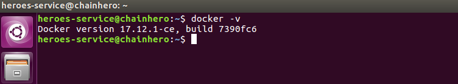

#### Mac OS X

Dowload and install the latest [`Docker.dmg`](https://docs.docker.com/docker-for-mac/install/) package for Mac OS X available on the [Docker](https://docs.docker.com/docker-for-mac/install/) website. This will install `docker-compose` as well.

#### Linux (not Ubuntu)

See links below:
- [Debian](https://docs.docker.com/engine/installation/linux/docker-ce/debian/)
- [Fedora](https://docs.docker.com/engine/installation/linux/docker-ce/fedora/)
- [CentOS](https://docs.docker.com/engine/installation/linux/docker-ce/centos/)

#### Windows

See instructions from the Docker website: [docker.com/docker-for-windows](https://docs.docker.com/docker-for-windows/install/)

### b. Docker Compose
**Docker-compose version 1.8 or greater is required.**


We are currently unable to manage multiple containers at once. To solve this issue, we need **docker-compose**.

#### Linux

The installation is pretty fast:

```
sudo curl -L https://github.com/docker/compose/releases/download/1.18.0/docker-compose-`uname -s`-`uname -m` -o /usr/local/bin/docker-compose &&
sudo chmod +x /usr/local/bin/docker-compose
```

Apply these changes by logout/login and then check its version with:

```
docker-compose version
```


#### Windows / Mac OS X / Others

See instructions from the Docker-compose website: [docker.com/docker-for-windows](https://docs.docker.com/compose/install/)

### c. Go
**Go version 1.7.x or greater is required.**


#### Linux

You can either follow instructions from [golang.org](https://golang.org/dl/) or use those generics commands that will install Golang 1.9.2 and prepare your environment (generate your `GOPATH`) for Ubuntu:

```
wget https://storage.googleapis.com/golang/go1.9.2.linux-amd64.tar.gz &&
sudo tar -C /usr/local -xzf go1.9.2.linux-amd64.tar.gz &&
rm go1.9.2.linux-amd64.tar.gz &&
echo 'export PATH=$PATH:/usr/local/go/bin' | sudo tee -a /etc/profile &&
echo 'export GOPATH=$HOME/go' | tee -a $HOME/.bashrc &&
echo 'export PATH=$PATH:$GOROOT/bin:$GOPATH/bin' | tee -a $HOME/.bashrc &&
mkdir -p $HOME/go/{src,pkg,bin}
```

To make sure that the installation works, you can logout/login (again) and run:

```
go version
```

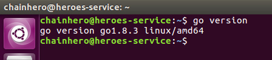


#### Windows / Mac OS X / Others

See instructions from the Golang website: [golang.org/install](https://golang.org/doc/install)

### d. Hyperledger Fabric & Certificate Authority (CA)

Now we can install the main framework: Hyperledger Fabric (Version 1.0.5). All the code is available on github:

```
mkdir -p $GOPATH/src/github.com/hyperledger &&
cd $GOPATH/src/github.com/hyperledger &&
git clone https://github.com/hyperledger/fabric.git &&
cd fabric &&
git checkout v1.0.5
```

Same for the Hyperledger Fabric CA part:

```
cd $GOPATH/src/github.com/hyperledger &&
git clone https://github.com/hyperledger/fabric-ca.git &&
cd fabric-ca &&
git checkout v1.0.5
```

We won’t use directly the framework but it's necessary to have it locally in your GOPATH to compile your app.

### e. Fabric SDK Go

Last but not least, the Hyperledger Fabric SDK Go will allow us to easily communicate with the Fabric framework. To avoid version issues, we are going to checkout to a specific commit which works with the following tutorial.

```
go get -u github.com/hyperledger/fabric-sdk-go &&
cd $GOPATH/src/github.com/hyperledger/fabric-sdk-go &&
git checkout cc04f203bb0940c3bf30342caa15a276cb6fb9d3
```

If you get the following error:

```
../fabric-sdk-go/vendor/github.com/miekg/pkcs11/pkcs11.go:29:18: fatal error: ltdl.h: No such file or directory
```

You need to install the package `libltdl-dev` and re-execute previous command (`go get ...`):

```
sudo apt install libltdl-dev
```

Let's make sure that you have the requested dependencies:

```
cd $GOPATH/src/github.com/hyperledger/fabric-sdk-go &&
make depend-install
```

Then you can go inside the new `fabric-sdk-go` directory in your GOPATH and install it correctly:

```
cd $GOPATH/src/github.com/hyperledger/fabric-sdk-go &&
make
```

The installation can take a while (depending on your network connection). During this process, a virtual network has been built and some tests have been made in order to check if your system is ready. Now we can work with our first application.

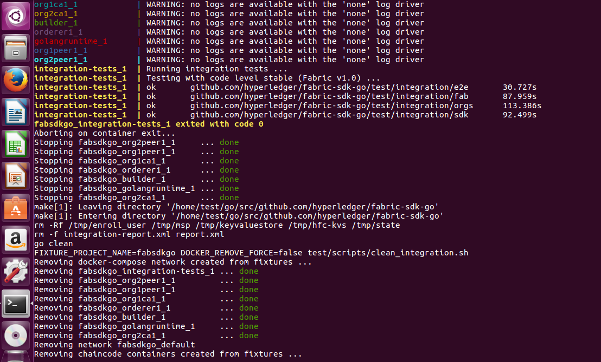

## 4. Make your first blockchain network

### a. Prepare environment

In order to make a blockchain network, we will use `docker` to build virtual computers that will handle different roles. In this tutorial we will stay as simple as possible. Hyperledger Fabric needs a lot of certificates to ensure encryption during the whole end to end process (SSL, TSL, authentification...). Fortunately, the Fabric SDK Go provides them. In order to use them, we simply use the network deployed by the testing part of the SDK.

Make a new directory in the `src` folder of your `GOPATH`, we name it `heroes-service`:

```
mkdir -p $GOPATH/src/github.com/chainHero/heroes-service &&
cd $GOPATH/src/github.com/chainHero/heroes-service
```

In the previous version of this tutorial we were starting from the SDK fixture folder. Due to a lot of changes in the new version, we decided to create our own and simplified it a little bit. You can either follow this command line, which will force you to download subversion package. Or download it from github. 

From command line:
```
sudo apt-get install subversion
cd $GOPATH/src/github.com/chainHero/heroes-service
svn checkout https://github.com/chainHero/heroes-service/branches/newVersion/fixtures
```

If you want to download it from GitHub, there is no other choice for you to download the whole repository and extract the fixture folder from it:

- [Github Repository](https://github.com/chainHero/heroes-service/archive/newVersion.zip)

Once its downloaded move the fixture folder here `$GOPATH/src/github.com/chainHero/heroes-service`.

### b. Test

In order to check if the network works, we will use `docker-compose` to start or stop all containers at the same time. Go inside the `fixtures` folder, and run:

```
cd $GOPATH/src/github.com/chainHero/heroes-service/fixtures &&
docker-compose up
```

You will see a lot of logs with different colors (for your information, red isn't equal to errors).

Open a new terminal and run:

```
docker ps
```

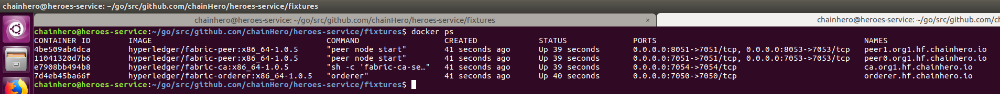

You will see : two peers, the orderer, two CA containers and two dependencies (golangruntime and builder) You have successfully made a new network ready to use with the SDK. To stop the network go back to the previous terminal, press `Ctrl+C` and wait that all containers are stopped. If you want to explore more deeper, check out the official documentation about this: [Building Your First Network](http://hyperledger-fabric.readthedocs.io/en/latest/build_network.html)

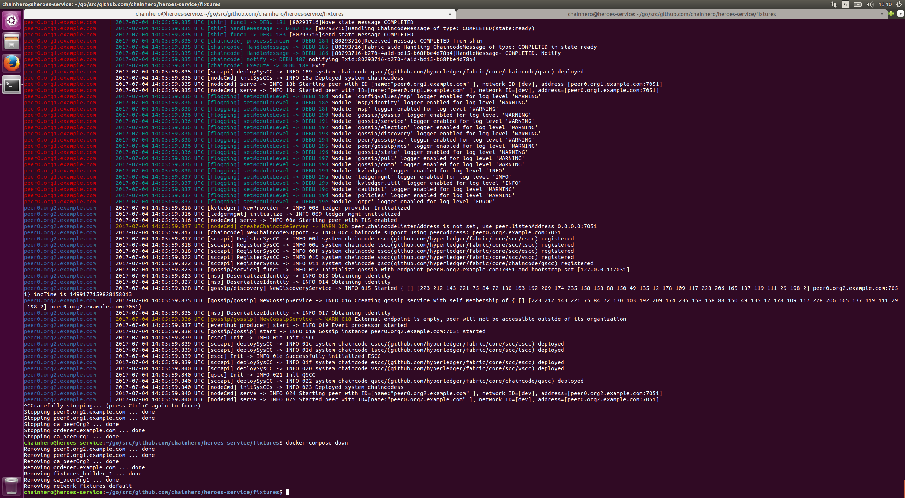
> Do not pay attention about the warnings. It's just indicating that we disabled logs. You can enable them inside the docker-compose.yaml file.

> **Tips**: when the network is stopped, all containers used remain accessible. This is very useful to check logs for example. You can see them with `docker ps -a`. In order to clean up these containers, you need to delete them with `docker rm $(docker ps -aq)` or if you have used a `docker-compose` file, go where this file is and run `docker-compose down`.

> **Tips**: you can run the `docker-compose` command in background to keep the prompt. To do so, use the parameter `-d`, like this: `docker-compose up -d`. To stop containers, run in the same folder where the `docker-compose.yaml` is, the command: `docker-compose stop` (or `docker-compose down` to clean up after all containers are stopped).


## 5. Use the Fabric SDK Go

### a. Configuration

As we removed the config folder, we need to make a new config file. We will put in it everything that the Fabric SDK Go and our custom parameters for our app needs to work. The config file will contain all our custom parameters and everything else the Fabric SDK Go needs for our app to work. For the moment, we will only try to make the Fabric SDK Go work with the default chaincode:

```
cd $GOPATH/src/github.com/chainhero/heroes-service && \
vi config.yaml
```

```
client:
 peers:
  # peer0
  - host: "localhost"
    port: 7051
    eventHost: "localhost"
    eventPort: 7053
    primary: true
    tls:
      # Certificate location absolute path
      certificate: "$GOPATH/src/github.com/chainhero/heroes-service/fixtures/channel/crypto-config/peerOrganizations/org1.example.com/peers/peer0.org1.example.com/cacerts/org1.example.com-cert.pem"
      serverHostOverride: "peer0.org1.example.com"

 tls:
  enabled: true

 security:
  enabled: true
  hashAlgorithm: "SHA2"
  level: 256

 tcert:
  batch:
    size: 200

 orderer:
  host: "localhost"
  port: 7050
  tls:
    # Certificate location absolute path
    certificate: "$GOPATH/src/github.com/chainhero/heroes-service/fixtures/channel/crypto-config/ordererOrganizations/example.com/orderers/orderer.example.com/cacerts/example.com-cert.pem"
    serverHostOverride: "orderer.example.com"

 logging:
  level: info

 fabricCA:
  tlsEnabled: true
  id: "Org1MSP"
  name: "ca-org1"
  homeDir: "/tmp/"
  mspDir: "msp"
  serverURL: "https://localhost:7054"
  certfiles :
    - "$GOPATH/src/github.com/chainhero/heroes-service/fixtures/tls/fabricca/ca/ca_root.pem"
  client:
   keyfile: "$GOPATH/src/github.com/chainhero/heroes-service/fixtures/tls/fabricca/client/client_client1-key.pem"
   certfile: "$GOPATH/src/github.com/chainhero/heroes-service/fixtures/tls/fabricca/client/client_client1.pem"

 cryptoconfig:
  path: "$GOPATH/src/github.com/chainhero/heroes-service/fixtures/channel/crypto-config"
```

The full configuration file is available here: [`config.yaml`](config.yaml)

### b. Initialise

We add a new folder named `blockchain` that will contain the whole interface that communicate with the network. We will see the Fabric SDK Go only in this folder.

```
mkdir $GOPATH/src/github.com/chainhero/heroes-service/blockchain
```

Now, we add a new go file named `setup.go` :

```
vi $GOPATH/src/github.com/chainhero/heroes-service/blockchain/setup.go
```

```
package blockchain

import (
	api "github.com/hyperledger/fabric-sdk-go/api"
	fsgConfig "github.com/hyperledger/fabric-sdk-go/pkg/config"
	bccspFactory "github.com/hyperledger/fabric/bccsp/factory"
	fcutil "github.com/hyperledger/fabric-sdk-go/pkg/util"
	"github.com/hyperledger/fabric-sdk-go/pkg/fabric-client/events"
	"fmt"
)

// FabricSetup implementation
type FabricSetup struct {
	Client           api.FabricClient
	Channel          api.Channel
	EventHub         api.EventHub
	Initialized      bool
	ChannelId        string
	ChannelConfig    string
}

// Initialize reads the configuration file and sets up the client, chain and event hub
func Initialize() (*FabricSetup, error) {

	// Add parameters for the initialization
	setup := FabricSetup{
		// Channel parameters
		ChannelId:        "mychannel",
		ChannelConfig:    "fixtures/channel/mychannel.tx",
	}

	// Initialize the configuration
	// This will read the config.yaml, in order to tell to
	// the SDK all options and how contact a peer
	configImpl, err := fsgConfig.InitConfig("config.yaml")
	if err != nil {
		return nil, fmt.Errorf("Initialize the config failed: %v", err)
	}

	// Initialize blockchain cryptographic service provider (BCCSP)
	// This tool manages certificates and keys
	err = bccspFactory.InitFactories(configImpl.GetCSPConfig())
	if err != nil {
		return nil, fmt.Errorf("Failed getting ephemeral software-based BCCSP [%s]", err)
	}

	// This will make a user access (here the admin) to interact with the network
	// To do so, it will contact the Fabric CA to check if the user has access
	// and give it to him (enrollment)
	client, err := fcutil.GetClient("admin", "adminpw", "/tmp/enroll_user", configImpl)
	if err != nil {
		return nil, fmt.Errorf("Create client failed: %v", err)
	}
	setup.Client = client

	// Make a new instance of channel pre-configured with the info we have provided,
	// but for now we can't use this channel because we need to create and
	// make some peer join it
	channel, err := fcutil.GetChannel(setup.Client, setup.ChannelId)
	if err != nil {
		return nil, fmt.Errorf("Create channel (%s) failed: %v", setup.ChannelId, err)
	}
	setup.Channel = channel

	// Get an orderer user that will validate a proposed order
	// The authentication will be made with local certificates
	ordererUser, err := fcutil.GetPreEnrolledUser(
		client,
		"ordererOrganizations/example.com/users/Admin@example.com/keystore",
		"ordererOrganizations/example.com/users/Admin@example.com/signcerts",
		"ordererAdmin",
	)
	if err != nil {
		return nil, fmt.Errorf("Unable to get the orderer user failed: %v", err)
	}

	// Get an organisation user (admin) that will be used to sign the proposal
	// The authentication will be made with local certificates
	orgUser, err := fcutil.GetPreEnrolledUser(
		client,
		"peerOrganizations/org1.example.com/users/Admin@org1.example.com/keystore",
		"peerOrganizations/org1.example.com/users/Admin@org1.example.com/signcerts",
		"peerorg1Admin",
	)
	if err != nil {
		return nil, fmt.Errorf("Unable to get the organisation user failed: %v", err)
	}

	// Initialize the channel "mychannel" based on the genesis block by
	//   1. locating in fixtures/channel/mychannel.tx and
	//   2. joining the peer given in the configuration file to this channel
	if err := fcutil.CreateAndJoinChannel(client, ordererUser, orgUser, channel, setup.ChannelConfig); err != nil {
		return nil, fmt.Errorf("CreateAndJoinChannel return error: %v", err)
	}

	// Give the organisation user to the client for next proposal
	client.SetUserContext(orgUser)

	// Setup Event Hub
	// This will allow us to listen for some event from the chaincode
	// and act on it. We won't use it for now.
	eventHub, err := getEventHub(client)
	if err != nil {
		return nil, err
	}
	if err := eventHub.Connect(); err != nil {
		return nil, fmt.Errorf("Failed eventHub.Connect() [%s]", err)
	}
	setup.EventHub = eventHub

	// Tell that the initialization is done
	setup.Initialized = true

	return &setup, nil
}

// getEventHub initialize the event hub
func getEventHub(client api.FabricClient) (api.EventHub, error) {
	eventHub, err := events.NewEventHub(client)
	if err != nil {
		return nil, fmt.Errorf("Error creating new event hub: %v", err)
	}
	foundEventHub := false
	peerConfig, err := client.GetConfig().GetPeersConfig()
	if err != nil {
		return nil, fmt.Errorf("Error reading peer config: %v", err)
	}
	for _, p := range peerConfig {
		if p.EventHost != "" && p.EventPort != 0 {
			fmt.Printf("EventHub connect to peer (%s:%d)\n", p.EventHost, p.EventPort)
			eventHub.SetPeerAddr(fmt.Sprintf("%s:%d", p.EventHost, p.EventPort),
				p.TLS.Certificate, p.TLS.ServerHostOverride)
			foundEventHub = true
			break
		}
	}

	if !foundEventHub {
		return nil, fmt.Errorf("No EventHub configuration found")
	}

	return eventHub, nil
}
```

The file is available here: [`blockchain/setup.go`](blockchain/setup.go)

At this stage, we only initialised a client that will communicate to a peer, a CA and an orderer. We also made a new channel and connected this peer to this channel. See the comments in the code for more information.

### c. Test

To make sure that the client managed to initialise all his components, we will make a simple test with the network launched. In order to do this, we need to build the go code. Since we we haven't any main file we have to add one:

```
cd $GOPATH/src/github.com/chainhero/heroes-service && \
vi main.go
```

```
package main

import (
	"github.com/chainhero/heroes-service/blockchain"
	"fmt"
	"os"
	"runtime"
	"path/filepath"
)

// Fix empty GOPATH with golang 1.8 (see https://github.com/golang/go/blob/1363eeba6589fca217e155c829b2a7c00bc32a92/src/go/build/build.go#L260-L277)
func defaultGOPATH() string {
	env := "HOME"
	if runtime.GOOS == "windows" {
		env = "USERPROFILE"
	} else if runtime.GOOS == "plan9" {
		env = "home"
	}
	if home := os.Getenv(env); home != "" {
		def := filepath.Join(home, "go")
		if filepath.Clean(def) == filepath.Clean(runtime.GOROOT()) {
			// Don't set the default GOPATH to GOROOT,
			// as that will trigger warnings from the go tool.
			return ""
		}
		return def
	}
	return ""
}

func main() {
	// Setup correctly the GOPATH in the environment
	if goPath := os.Getenv("GOPATH"); goPath == "" {
		os.Setenv("GOPATH", defaultGOPATH())
	}

	// Initialize the Fabric SDK
	_, err := blockchain.Initialize()
	if err != nil {
		fmt.Printf("Unable to initialize the Fabric SDK: %v", err)
	}
}
```

The file is available here: [`main.go`](main.go)

As you can see, we fixed the GOPATH of the environment if it's not set. We will need this feature in order to compile the chaincode (we will see this in the next step).

The last thing to do before starting the compilation is to use a vendor directory. In our GOPATH we have Fabric, Fabric CA, Fabric SDK Go and maybe other projects. When we will try to compile our app, there may be some conflicts (like multiple definitions of BCCSP). We will handle this by using a tool like `govendor` to flatten these dependencies. Just install it and import external dependencies inside the vendor directory like this:

```
go get -u github.com/kardianos/govendor && \
cd $GOPATH/src/github.com/chainhero/heroes-service && \
govendor init && govendor add +external
```

Now we can make the compilation:

```
cd $GOPATH/src/github.com/chainhero/heroes-service && \
go build
```

After some time, a new binary named `heroes-service` will appear at the root of the project. Try to start the binary like this:

```
cd $GOPATH/src/github.com/chainhero/heroes-service && \
./heroes-service
```

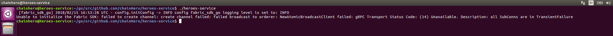

At this point, it won't work because there is no network deployed that the SDK can talk with. Start the network and launch the app again:

```
cd $GOPATH/src/github.com/chainhero/heroes-service/fixtures && \
docker-compose up -d && \
cd .. && \
./heroes-service
```

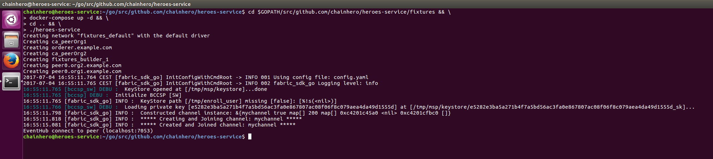

Great! We initialised the SDK with our local network. In the next step, we will interact with a chaincode.

### d. Clean up and Makefile

The Fabric SDK generates some files, like certificates and/or temporally files. Shutting down the network won't fully clean up your environment and when you will need to start it again, these files will be reused to avoid building process. For development you can keep them to test quickly but for a real test, you need to clean up all and start from the beginning.

*How clean up my environment ?*

- Shut down your network: `cd $GOPATH/src/github.com/chainhero/heroes-service/fixtures && docker-compose down`
- Remove MSP folder (defined in the [config](config.yaml) file, in the `fabricCA` section): `rm -rf /tmp/msp`
- Remove enrolment files (defined when we initialise the SDK, in the [setup](blockchain/setup.go) file, when we get the client):  `rm -rf /tmp/enroll_user`
- Remove some docker containers and docker images not generated by the `docker-compose` command: ```docker rm -f -v `docker ps -a --no-trunc | grep "heroes-service" | cut -d ' ' -f 1` 2>/dev/null``` and ```docker rmi `docker images --no-trunc | grep "heroes-service" | cut -d ' ' -f 1` 2>/dev/null```

*How to be more efficient ?*

We can automatise all these tasks in one single step. Also the build and start process can be automated. To do so, we will create a Makefile. First, ensure that you have the tool:

```
make --version
```
If `make` is not installed do (Ubuntu):

```
sudo apt install make
```

Then create a file named `Makefile` at the root of the project with this content:

```
.PHONY: all dev clean build env-up env-down run

all: clean build env-up run

dev: build run

##### BUILD
build:
	@echo "Build ..."
	@govendor sync
	@go build
	@echo "Build done"

##### ENV
env-up:
	@echo "Start environnement ..."
	@cd fixtures && docker-compose up --force-recreate -d
	@echo "Sleep 15 seconds in order to let the environment setup correctly"
	@sleep 15
	@echo "Environnement up"

env-down:
	@echo "Stop environnement ..."
	@cd fixtures && docker-compose down
	@echo "Environnement down"

##### RUN
run:
	@echo "Start app ..."
	@./heroes-service

##### CLEAN
clean: env-down
	@echo "Clean up ..."
	@rm -rf /tmp/enroll_user /tmp/msp heroes-service
	@docker rm -f -v `docker ps -a --no-trunc | grep "heroes-service" | cut -d ' ' -f 1` 2>/dev/null || true
	@docker rmi `docker images --no-trunc | grep "heroes-service" | cut -d ' ' -f 1` 2>/dev/null || true
	@echo "Clean up done"
```

The file is available here: [`Makefile`](Makefile)

Now with the task `all`:
1. the whole environment will be cleaned up,
2. then our go program will be compiled,
3. after which the network will be deployed and
4. finally the app will be up and running.

To use it, go in the root of the project and use the `make` command:

- Task `all`: `make` or `make all`
- Task `build`: `make build`
- Task `env-up`: `make env-up`
- ...

### e. Install & instanciate a chaincode

We are almost there to use the blockchain system. But for now we haven't set up any chaincode (smart contract) yet that will handle queries from our application. First, let's create a new directory named `chaincode` and add a new file named `main.go`:

```
cd $GOPATH/src/github.com/chainhero/heroes-service && \
mkdir chaincode && \
vi chaincode/main.go
```

```
package main

import (
	"fmt"
	"github.com/hyperledger/fabric/core/chaincode/shim"
	pb "github.com/hyperledger/fabric/protos/peer"
)

// HeroesServiceChaincode implementation of Chaincode
type HeroesServiceChaincode struct {
}

// Init of the chaincode
// This function is called only one when the chaincode is instantiated.
// So the goal is to prepare the ledger to handle future requests.
func (t *HeroesServiceChaincode) Init(stub shim.ChaincodeStubInterface) pb.Response {
	fmt.Println("########### HeroesServiceChaincode Init ###########")

	// Get the function and arguments from the request
	function, _ := stub.GetFunctionAndParameters()

	// Check if the request is the init function
	if function != "init" {
		return shim.Error("Unknown function call")
	}

	// Put in the ledger the key/value hello/world
	err := stub.PutState("hello", []byte("world"))
	if err != nil {
		return shim.Error(err.Error())
	}

	// Return a successful message
	return shim.Success(nil)
}

// Invoke
// All future requests named invoke will arrive here.
func (t *HeroesServiceChaincode) Invoke(stub shim.ChaincodeStubInterface) pb.Response {
	fmt.Println("########### HeroesServiceChaincode Invoke ###########")

	// Get the function and arguments from the request
	function, args := stub.GetFunctionAndParameters()

	// Check whether it is an invoke request
	if function != "invoke" {
		return shim.Error("Unknown function call")
	}

	// Check whether the number of arguments is sufficient
	if len(args) < 1 {
		return shim.Error("The number of arguments is insufficient.")
	}

	// In order to manage multiple type of request, we will check the first argument.
	// Here we have one possible argument: query (every query request will read in the ledger without modification)
	if args[0] == "query" {
		return t.query(stub, args)
	}

	// If the arguments given don’t match any function, we return an error
	return shim.Error("Unknown action, check the first argument")
}

// query
// Every readonly functions in the ledger will be here
func (t *HeroesServiceChaincode) query(stub shim.ChaincodeStubInterface, args []string) pb.Response {

	// Check whether the number of arguments is sufficient
	if len(args) < 2 {
		return shim.Error("The number of arguments is insufficient")
	}

	// Like the Invoke function, we manage multiple type of query requests with the second argument.
	// We also have only one possible argument: hello
	if args[1] == "hello" {

		// Get the state of the value matching the key hello in the ledger
		state, err := stub.GetState("hello")
		if err != nil {
			return shim.Error("Failed to get state of hello")
		}

		// Return this value in response
		return shim.Success(state)
	}

	// If the arguments given don’t match any function, we return an error
	return shim.Error("Unknown query action, check the second argument.")
}

func main() {
	// Start the chaincode and make it ready for futures requests
	err := shim.Start(new(HeroesServiceChaincode))
	if err != nil {
		fmt.Printf("Error starting Heroes Service chaincode: %s\n", err)
	}
}
```

The file is available here: [`chaincode/main.go`](chaincode/main.go)

> We choose to put the chaincode here to make the application simpler, but from an architecture point of view, it will be better to use the architectural given by the SDK and put the chaincode in the `src` folder of `fixtures`. The chaincode isn't really related to the application, we can have one repository for the app and another for the chaincode. For your information, in a near future, the chaincode could be written in other languages.

For now, the chaincode does nothing extraordinary, just put the key/value `hello`/`world` in the ledger at initialisation. In addition, there is one function that we can call by an invoke: `query hello`. This function gets the state of the ledger, i.e. `hello` and give it in response. We will test this in the next step, after successfully install and instantiate the chaincode.

In order to install and instantiate the chaincode, we need to add some code in the application. Edit the [`blockchain/setup.go`](blockchain/setup.go) and add this following lines:

> line 3 of [`blockchain/setup.go`](blockchain/setup.go): we add the OS import to get access to the GOPATH variable in the environment

```
import (
	api "github.com/hyperledger/fabric-sdk-go/api"
	fsgConfig "github.com/hyperledger/fabric-sdk-go/pkg/config"
	bccspFactory "github.com/hyperledger/fabric/bccsp/factory"
	fcutil "github.com/hyperledger/fabric-sdk-go/pkg/util"
	"github.com/hyperledger/fabric-sdk-go/pkg/fabric-client/events"
	"fmt"
	"os"
)
```

> line 13 of [`blockchain/setup.go`](blockchain/setup.go): we add chaincode parameters

```
// FabricSetup implementation
type FabricSetup struct {
	Client           api.FabricClient
	Channel          api.Channel
	EventHub         api.EventHub
	Initialized      bool
	ChannelId        string
	ChannelConfig    string
	ChaincodeId      string
	ChaincodeVersion string
	ChaincodeGoPath  string
	ChaincodePath    string
}
```

> line 28 of [`blockchain/setup.go`](blockchain/setup.go): we set new parameters

```
func Initialize() (*FabricSetup, error) {

	// Add parameters for the initialization
	setup := FabricSetup{
		// Channel parameters
		ChannelId:        "mychannel",
		ChannelConfig:    "fixtures/channel/mychannel.tx",

		// Chaincode parameters
		ChaincodeId:      "heroes-service",
		ChaincodeVersion: "v1.0.0",
		ChaincodeGoPath:  os.Getenv("GOPATH"),
		ChaincodePath:    "github.com/chainhero/heroes-service/chaincode",
	}
    
    [...]
}
```

> line 156 of [`blockchain/setup.go`](blockchain/setup.go): we add the function that will install and instantiate the chaincode

```
// Install and instantiate the chaincode
func (setup *FabricSetup) InstallAndInstantiateCC() error {

	// Check if chaincode ID is provided
	// otherwise, generate a random one
	if setup.ChaincodeId == "" {
		setup.ChaincodeId = fcutil.GenerateRandomID()
	}

	fmt.Printf(
		"Chaincode %s (version %s) will be installed (Go Path: %s / Chaincode Path: %s)\n",
		setup.ChaincodeId,
		setup.ChaincodeVersion,
		setup.ChaincodeGoPath,
		setup.ChaincodePath,
	)

	// Install ChainCode
	// Package the go code and make a proposal to the network with this new chaincode
	err := fcutil.SendInstallCC(
		setup.Client, // The SDK client
		setup.Channel, // The channel concerned
		setup.ChaincodeId,
		setup.ChaincodePath,
		setup.ChaincodeVersion,
		nil,
		setup.Channel.GetPeers(), // Peers concerned by this change in the channel
		setup.ChaincodeGoPath,
	)
	if err != nil {
		return fmt.Errorf("Send install proposal return error: %v", err)
	} else {
		fmt.Printf("Chaincode %s installed (version %s)\n", setup.ChaincodeId, setup.ChaincodeVersion)
	}

	// Instantiate ChainCode
	// Call the Init function of the chaincode in order to initialize in every peer the new chaincode
	err = fcutil.SendInstantiateCC(
		setup.Channel,
		setup.ChaincodeId,
		setup.ChannelId,
		[]string{"init"}, // Arguments for the invoke request
		setup.ChaincodePath,
		setup.ChaincodeVersion,
		[]api.Peer{setup.Channel.GetPrimaryPeer()}, // Which peer to contact
		setup.EventHub,
	)
	if err != nil {
		return err
	} else {
		fmt.Printf("Chaincode %s instantiated (version %s)\n", setup.ChaincodeId, setup.ChaincodeVersion)
	}

	return nil
}
```

The file is available here: [`blockchain/setup.go`](blockchain/setup.go)

> **Tips**: take care of the chaincode version, if you want to update your chaincode, increment this number. Otherwise the network will keep the same chaincode.

Finally, we add the call to this function in the [`main.go`](main.go) after the SDK initialisation:


> line 38 of [`main.go`](main.go): we add the function that will install and instantiate the chaincode

```
func main() {

[...]

	// Initialize the Fabric SDK
	fabricSdk, err := blockchain.Initialize()
	if err != nil {
		fmt.Printf("Unable to initialize the Fabric SDK: %v\n", err)
	}

	// Install and instantiate the chaincode
	err = fabricSdk.InstallAndInstantiateCC()
	if err != nil {
		fmt.Printf("Unable to install and instantiate the chaincode: %v\n", err)
	}
}
```

The file is available here: [`main.go`](main.go)

We can test this, just with the `make` command setup in the previous step:

```
cd $GOPATH/src/github.com/chainhero/heroes-service && \
make
```

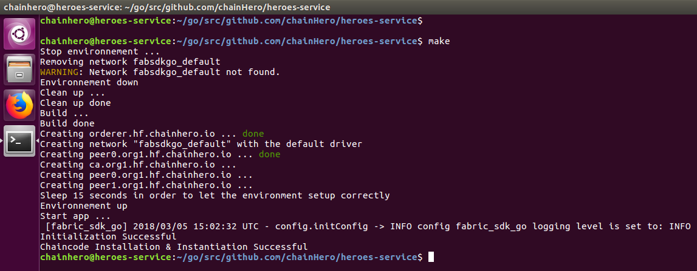

> **Tips**: the installation and the instantiation don't need to be run at every start of the application. Only when we update the chaincode (and the chaincode version). A solution is to provide an argument when we run the application to tell to do this additional procedure before move on. Since in this tutorial we will clean up the environment every time we don't really care about that.

### f. Query the chaincode

Like a database, the chaincode is plugged and ready to answer. Let's try the `hello` query.

We will put all query functions in a new file named `query.go` in the `blockchain` folder:

```
cd $GOPATH/src/github.com/chainhero/heroes-service && \
vi blockchain/query.go
```

```
package blockchain

import (
	fcutil "github.com/hyperledger/fabric-sdk-go/pkg/util"
	api "github.com/hyperledger/fabric-sdk-go/api"
	"fmt"
)

// QueryHello query the chaincode to get the state of hello
func (setup *FabricSetup) QueryHello() (string, error) {

	// Prepare arguments
	var args []string
	args = append(args, "invoke")
	args = append(args, "query")
	args = append(args, "hello")

	// Make the proposal and submit it to the network (via our primary peer)
	transactionProposalResponses, _, err := fcutil.CreateAndSendTransactionProposal(
		setup.Channel,
		setup.ChaincodeId,
		setup.ChannelId,
		args,
		[]api.Peer{setup.Channel.GetPrimaryPeer()}, // Peer contacted when submitted the proposal
		nil,
	)
	if err != nil {
		return "", fmt.Errorf("Create and send transaction proposal return error in the query hello: %v", err)
	}
	return string(transactionProposalResponses[0].ProposalResponse.GetResponse().Payload), nil
}
```

The file is available here: [`blockchain/query.go`](blockchain/query.go)

Add the call to this new function in the [`main.go`](main.go):

> line 49 of [`main.go`](main.go)

```
func main() {

[...]

	// Query the chaincode
	response, err := fabricSdk.QueryHello()
	if err != nil {
		fmt.Printf("Unable to query hello on the chaincode: %v\n", err)
	} else {
		fmt.Printf("Response from the query hello: %s\n", response)
	}
}
```

The file is available here: [`main.go`](main.go)

Let's try:

```
cd $GOPATH/src/github.com/chainhero/heroes-service && \
make
```

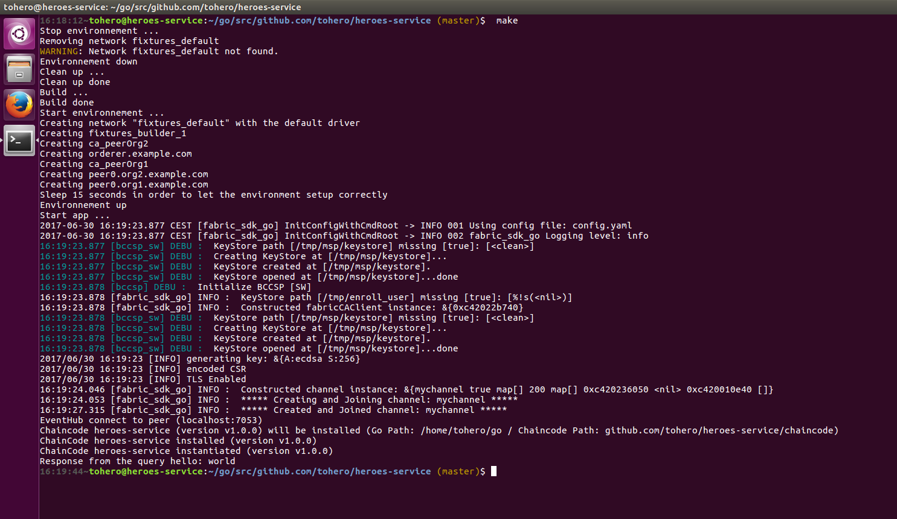

### g. Change the ledger state

The next thing to do in order to make a basic tour of the Fabric SDK Go, is to make a request to the chaincode in order to change the ledger state.

First, we will add this ability in the chaincode. Edit the [`chaincode/main.go`](chaincode/main.go) file:

> line 97 of [`chaincode/main.go`](chaincode/main.go)

```
// invoke
// All functions that read and write in the ledger will be here
func (t *HeroesServiceChaincode) invoke(stub shim.ChaincodeStubInterface, args []string) pb.Response {

	if len(args) < 2 {
		return shim.Error("The number of arguments is insufficient, you need to provide the function for the invoke.")
	}

	if args[1] == "hello" && len(args) == 3 {

		//
		err := stub.PutState("hello", []byte(args[2]))
		if err != nil {
			return shim.Error("Failed to update state of hello")
		}

		// Return this value in response
		return shim.Success(nil)
	}

	// If the arguments given don't match any function, we return an error
	return shim.Error("Unknown invoke action, check the second argument.")
}
```

> line 57 of [`chaincode/main.go`](chaincode/main.go)

```
func (t *HeroesServiceChaincode) Invoke(stub shim.ChaincodeStubInterface) pb.Response {

[...]

	if args[0] == "query" {
		return t.query(stub, args)
	}

	// The update argument will manage all update in the ledger
	if args[0] == "invoke" {
		return t.invoke(stub, args)
	}

[...]

}
```

The file is available here: [`chaincode/main.go`](chaincode/main.go)

From the application side, we add a new interface to make the invocation of the chaincode. Add a file named `invoke.go` in the `blockchain` folder:

```
cd $GOPATH/src/github.com/chainhero/heroes-service && \
vi blockchain/invoke.go
```

```
package blockchain

import (
	fcutil "github.com/hyperledger/fabric-sdk-go/pkg/util"
	api "github.com/hyperledger/fabric-sdk-go/api"
	"fmt"
	"time"
)

// InvokeHello
func (setup *FabricSetup) InvokeHello(value string) (string, error) {

	// Prepare arguments
	var args []string
	args = append(args, "invoke")
	args = append(args, "invoke")
	args = append(args, "hello")
	args = append(args, value)

	// Add data that will be visible in the proposal, like a description of the invoke request
	transientDataMap := make(map[string][]byte)
	transientDataMap["result"] = []byte("Transient data in hello invoke")

	// Make a next transaction proposal and send it
	transactionProposalResponse, txID, err := fcutil.CreateAndSendTransactionProposal(
		setup.Channel,
		setup.ChaincodeId,
		setup.ChannelId,
		args,
		[]api.Peer{setup.Channel.GetPrimaryPeer()},
		transientDataMap,
	)
	if err != nil {
		return "", fmt.Errorf("Create and send transaction proposal in the invoke hello return error: %v", err)
	}

	// Register the Fabric SDK to listen to the event that will come back when the transaction will be send
	done, fail := fcutil.RegisterTxEvent(txID, setup.EventHub)

	// Send the final transaction signed by endorser
	if _, err := fcutil.CreateAndSendTransaction(setup.Channel, transactionProposalResponse); err != nil {
		return "", fmt.Errorf("Create and send transaction in the invoke hello return error: %v", err)
	}

	// Wait for the result of the submission
	select {
	// Transaction Ok
	case <-done:
		return txID, nil

	// Transaction failed
	case <-fail:
		return "", fmt.Errorf("Error received from eventhub for txid(%s) error(%v)", txID, fail)

	// Transaction timeout
	case <-time.After(time.Second * 30):
		return "", fmt.Errorf("Didn't receive block event for txid(%s)", txID)
	}
}
```

The file is available here: [`blockchain/invoke.go`](blockchain/invoke.go)

Add the call to this function in the [`main.go`](main.go):

> line 49 of [`main.go`](main.go)

```
func main() {

[...]

	// Query the chaincode
	response, err := fabricSdk.QueryHello()
	if err != nil {
		fmt.Printf("Unable to query hello on the chaincode: %v\n", err)
	} else {
		fmt.Printf("Response from the query hello: %s\n", response)
	}

	// Invoke the chaincode
	txId, err := fabricSdk.InvokeHello("chainHero")
	if err != nil {
		fmt.Printf("Unable to invoke hello on the chaincode: %v\n", err)
	} else {
		fmt.Printf("Successfully invoke hello, transaction ID: %s\n", txId)
	}

	// Query again the chaincode
	response, err = fabricSdk.QueryHello()
	if err != nil {
		fmt.Printf("Unable to query hello on the chaincode: %v\n", err)
	} else {
		fmt.Printf("Response from the query hello: %s\n", response)
	}
}
```

The file is available here: [`main.go`](main.go)

Let's try:

```
cd $GOPATH/src/github.com/chainhero/heroes-service && \
make
```

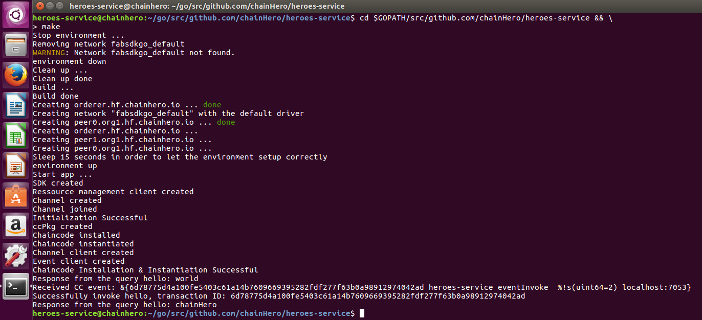

## 6. Make this in a web application

We also can make this usable for any user. The best choice is a web application and we are lucky because the Go language natively provides a web server handling HTTP requests and also templating for HTML.

For now, we have only two different actions: the query and the invocation of the hello value. Let's make two HTML pages for each action. We add a [`web`](web) directory with three other directories:
- [`web/templates`](web/templates): contains all HTML pages (templates)
- [`web/assets`](web/assets): contains all CSS, Javascript, Fonts, Images...
- [`web/controllers`](web/controllers): contains all functions that will render templates

We use the MVC (Model-View-Controller) to make it more readable. The Model will be the blockchain part, the View are templates and Controller are provided by functions in the [`controllers`](web/controllers) directory.

Populate each with the appropriate code (we also added Bootstrap to make the result a little prettier:

- [`web/templates/layout.html`](web/templates/layout.html)
- [`web/templates/home.html`](web/templates/home.html)
- [`web/templates/request.html`](web/templates/request.html)
- [`web/controllers/controller.go`](web/controllers/controller.go)
- [`web/controllers/home.go`](web/controllers/home.go)
- [`web/controllers/request.go`](web/controllers/request.go)
- [`web/app.go`](web/app.go)
- [`web/assets`](web/assets)

And finaly, we change the [`main.go`](main.go), in order to use the web interface instead of directly query the blockchain.

- [`main.go`](main.go)

Run the app and go to [localhost:3000/home.html](http://localhost:3000/home.html):

```
cd $GOPATH/src/github.com/chainhero/heroes-service && \
make
```

The `home` page make a query in in the blockchain to get the value of the `hello` key and display it.

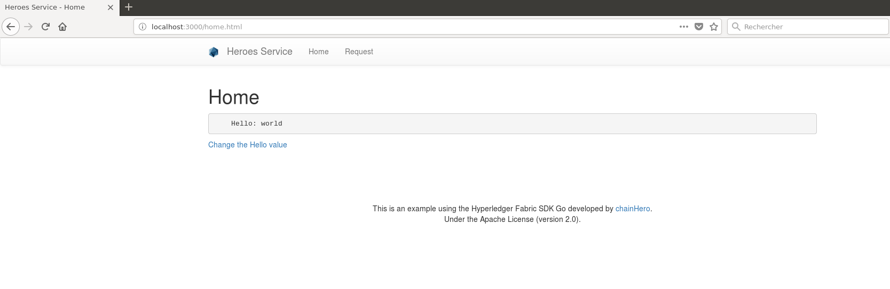

The `request` page has a form to change the `hello` value. After a successful submission the transaction ID is given.

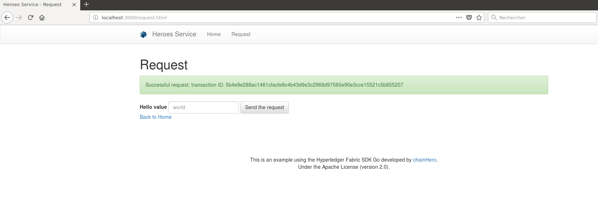

We can see the change by going back to the `home` page.


**It's the end for the first part. A more complex application is coming.**

## 7. References

- [Hyperledger website](https://www.hyperledger.org/)
- [Hyperledger Fabric online documentation](http://hyperledger-fabric.readthedocs.io/en/latest/)
- [Hyperledger Fabric on github](https://github.com/hyperledger/fabric)
- [Hyperledger Fabric Certificate Authority on github](https://github.com/hyperledger/fabric-ca)
- [Hyperledger Fabric SDK Go on github](https://github.com/hyperledger/fabric-sdk-go)
- [Fabric SDK Go tests](https://github.com/hyperledger/fabric-sdk-go/blob/master/test/integration/end_to_end_test.go)
- [CLI](https://github.com/securekey/fabric-examples/tree/master/fabric-cli/): An example CLI for Fabric built with the Go SDK.
